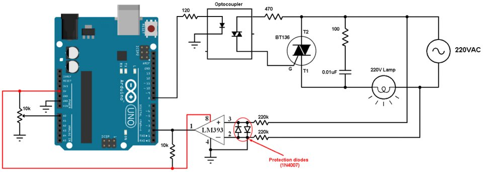

# COMPOSITION
* zerocrssing circuit

# code for zerocrossing
* https://github.com/tehniq3/ac-dimmer_with_triac

# COMPONENT
* moc3021
* tlp620/lm396
* triac/bt136/BTA06-600E
* 220k resistance  * 2 / 10k * 2  /  120 / 470 /
* 220v 50W lamp

# CIRCUIT

